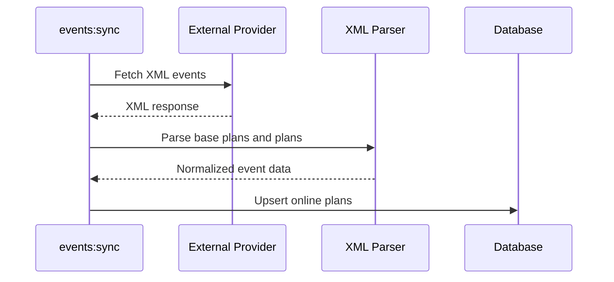
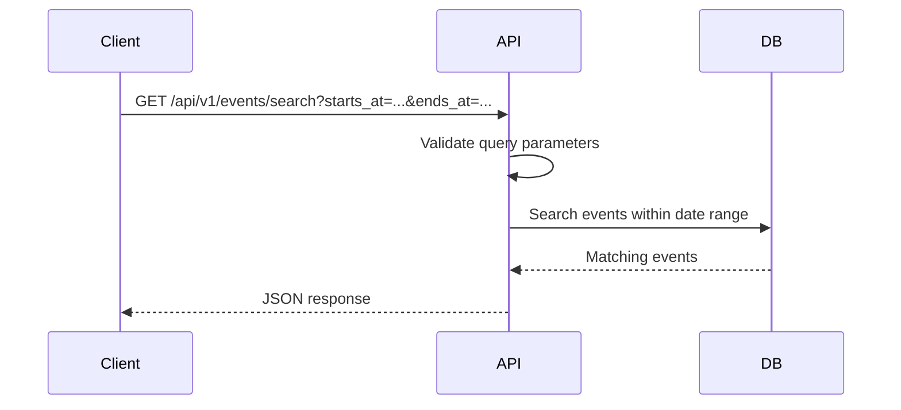
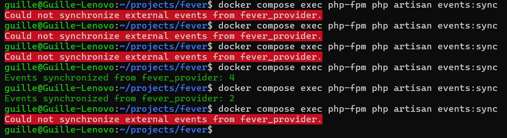

# Code challenge

Welcome! We're thrilled to have you at this stage of the process. This challenge is designed to give us insight into your coding approach and problem-solving skills. It’s a simplified example of real-world scenarios.

## The challenge

Your task is to develop a microservice that integrates plans from an external provider into the our marketplace.

Even if this is just a disposable test, imagine that somebody will pick up this code and maintain it in the future. It will evolve new features will be added, existing ones adapted, and unnecessary functionalities removed. Writing clean, scalable, and maintainable code is crucial for ensuring the sustainability of any project.

> [!TIP]
> This should be conceived as a long-term project, not just one-off code.

The external provider exposes an endpoint: https://provider.code-challenge.feverup.com/api/events

This API returns a list of available plans in XML format. Plans that are no longer available will not be included in future responses. Here are three example responses over consecutive API calls:

- [Response 1](https://gist.githubusercontent.com/acalvotech/55223c0e5c55baa33086e2383badba64/raw/1cab82e2d1f3adc8d3b3dace0a409844bed698f0/response_1.xml)
- [Response 2](https://gist.githubusercontent.com/acalvotech/d9c6fc5a5920bf741638d6179c8c07ed/raw/2b4ca961f05b2eebc0682f21357d37ac0eb5c80a/response_2.xml)
- [Response 3](https://gist.githubusercontent.com/acalvotech/7c107daacfd05f32c1c1bcd7209d85ef/raw/ea4c4c8d2b7ccf2ae2be153d45353fb7187f5236/response_3.xml)

> [!WARNING]
> The API endpoint has been designed with real-world conditions in mind, where network requests don’t always behave ideally. Your solution should demonstrate how you handle various scenarios that could occur in production environments. **Don’t assume the API endpoint will always respond successfully and with low latency.**

## Your Task

You need to **develop and expose a single endpoint**:

- The endpoint should accept `starts_at` and `ends_at` parameters and return only the plans within this time range.
- Plans should be included if they were ever available (with `"sell_mode": "online"`).
- Past plans should be retrievable even if they are no longer present in the provider’s latest response.
- The endpoint must be performant, responding in **hundreds of milliseconds**, regardless of the state of other external services. For instance, if the external provider service is down, our search endpoint should still work as usual. Similarly, it should also respond quickly to all requests regardless of the traffic we receive.

## Solution

This solution implements a Laravel-based microservice that exposes a single search endpoint for our marketplace events.

The main design decision is to keep the public search endpoint completely independent from the external provider availability. Instead of calling the provider on every API request, the application synchronizes provider data into a local database through an Artisan command. The API then reads only from local persisted data, which allows it to respond quickly even if the external provider is slow, unavailable, or returning invalid responses.

Only plans with `sell_mode="online"` are stored. Once a plan has been synchronized, it remains available in the local database, even if it disappears from future provider responses. This satisfies the requirement that past plans should still be retrievable.

### Design choices

- **Local persistence first**: the API does not depend on the external provider during user requests.
- **Resilient synchronization**: provider failures are handled in the synchronization command and logged without breaking the search endpoint.
- **Historical availability**: synchronized plans are not deleted when they disappear from the provider response.
- **Provider abstraction**: external sources are represented through a contract, making it easier to add more providers in the future.
- **Simple deployment**: Docker Compose and a `Makefile` are provided so the application can be started with a single command.
- **SQLite for the challenge**: SQLite keeps the setup simple and portable. For production, the same model could be moved to PostgreSQL or MySQL with proper indexing.

### Synchronization flow



### Request flow



### Implementation details

The synchronization command fetches the XML from the provider, parses all `base_plan` nodes, filters out non-online plans, extracts the relevant plans and zones, calculates minimum and maximum prices, and stores the normalized data in the `events` table.

The search endpoint receives `starts_at` and `ends_at` query parameters and returns the events that match the requested time range using the locally stored data.

This approach makes the API fast and predictable because request latency depends mainly on the database query, not on external network calls.

### Requirements

- Docker
- Docker Compose

The application runs inside Docker, so PHP and Composer do not need to be installed locally.

### Getting started

#### 1. Clone the repository

```bash
git clone git@github.com:gafernandez25/sync-events.git events
cd events
```

You can change the destination directory name

#### 2. Deploy the application

```bash
make run
```

".env" file will be created with default MySql credentials, password can be modified.
```env
DB_USERNAME=root
DB_PASSWORD=root
```

#### 3. Populate the database with data from external provider

```bash
make sync-events
```

⚠️ It's possible that this command fails because the external API is not 100% reliable. It can be run all the times you want.



### API endpoints

#### List events
```bash
http://localhost:806/api/v1/events/search?starts_at=2021-01-31T00:00:00Z&ends_at=2021-12-31T21:00:00Z
```

### Running the tests

To run the full test suite:

```bash
make test
```
